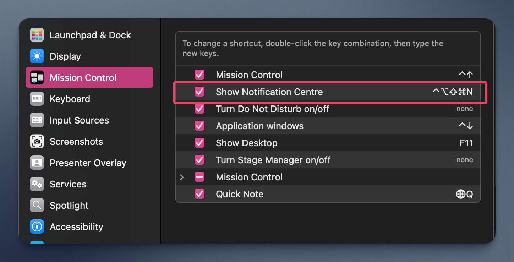

# Noti Tools

A workflow that I have created to handle macOS notification center, inspired by [Banner Be Gone](https://alfred.app/workflows/alfredapp/banner-be-gone/)

> There's a known issue where use `noti` + ⌘ when a new notification appear, notification center would not open up

## Setup

First and foremost you need to enable and set your keyboard shortcut for "Show Notification Centre" here:

Then, set the same shortcut in Alfred Workflow:

## Usage

`noti` - Show notification center

`noti` + ⌘ - Clear notifications (will open notification center to clear notifications)

`noticlear` - Clear visible notifications only (Same behaviour as Banner Be Gone).